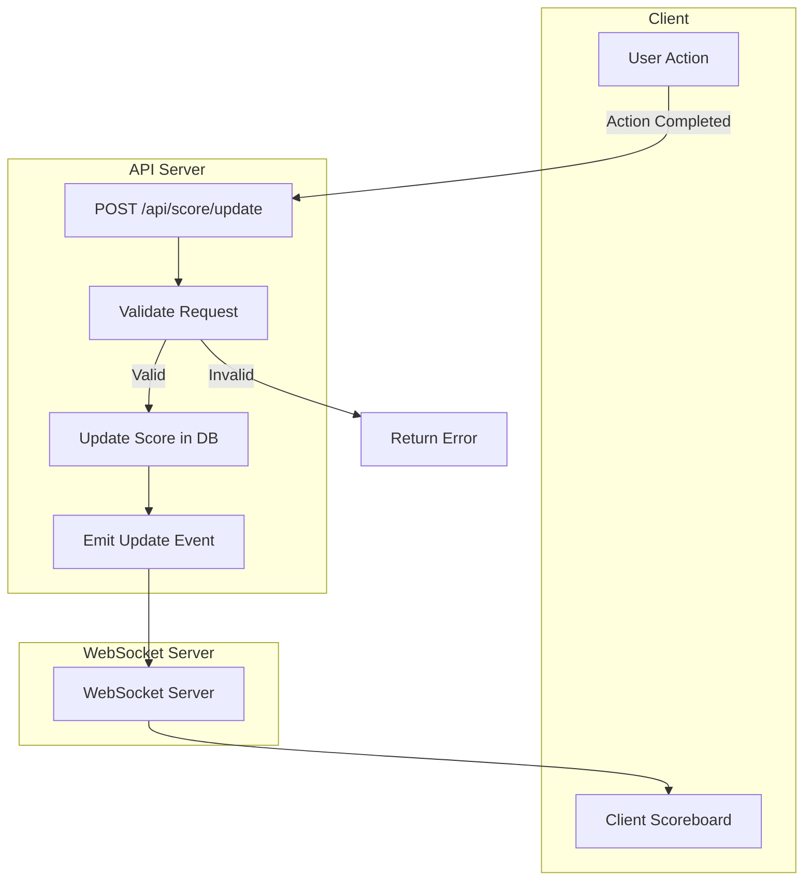

### `README.md` for Scoreboard Module

## Overview

The Scoreboard Module is responsible for managing user scores, updating the scoreboard in real-time, and ensuring security measures to prevent unauthorized score manipulation.

## Features

1. **Real-time Scoreboard Update:** Display the top 10 user scores with live updates.
2. **Score Increment:** Increase user scores based on user actions.
3. **Security:** Prevent unauthorized score increases.

## API Endpoints

### Update Score

**Endpoint:** `POST /api/score/update`

**Description:** Increases the score of a user upon completion of an action.

**Request:**
```json
{
  "userId": "string",
  "action": "string"
}
```

**Response:**
```json
{
  "success": true,
  "newScore": "number"
}
```

### Get Top Scores

**Endpoint:** `GET /api/score/top`

**Description:** Retrieves the top 10 user scores.

**Response:**
```json
[
  {
    "userId": "string",
    "score": "number"
  },
  // ... up to 10 users
]
```

## Installation

1. Clone the repository:
   ```sh
   cd problem6
   ```

2. Install dependencies:
   ```sh
   npm install
   ```

3. Set up environment variables:
   ```env
   PORT=3000
   MONGO_URI=your_mongodb_uri
   JWT_SECRET=your_jwt_secret
   ```

4. Start the server:
   ```sh
   npm start
   ```

## Diagram

### Flow of Execution



## Improvements

1. **Caching:** Implement a caching mechanism (e.g., Redis) for quick retrieval of the top scores.
2. **Rate Limiting:** Add rate limiting to prevent abuse of the score update endpoint.
3. **Logging:** Implement a logging system to monitor API calls and detect suspicious activities.
4. **Testing:** Write comprehensive unit and integration tests to ensure reliability.

---

This specification outlines the necessary components and steps to implement the Scoreboard Module, ensuring real-time updates and security measures. The diagram provides a visual flow of the execution process, aiding in understanding and development.